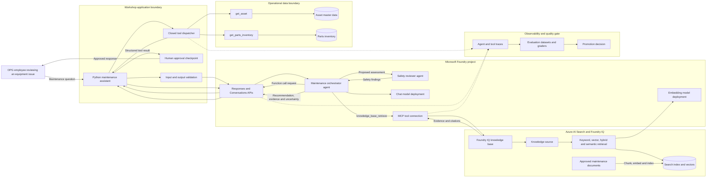
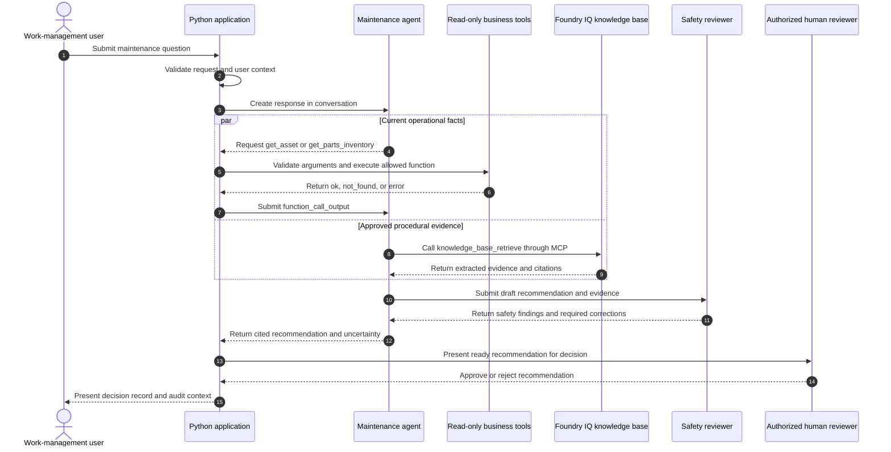
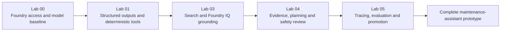

# Workshop Outcome Architecture

The workshop progressively builds an **OPG Work Order Maintenance Assistant**: a maintenance-planning application that combines model reasoning, current operational facts, approved procedural evidence, safety review, human approval, and quality controls.

The outcome is a reference architecture and working prototype, not a production connection to operational technology. Workshop data and business systems remain synthetic and read-only.

## Solution Scope

This is a **work-planning and review assistant**. It reviews a reported equipment issue, gathers equipment and inventory facts, retrieves procedural evidence, identifies gaps or conflicts, proposes next steps, and prepares a package for an authorized human reviewer.

It is not a field-worker assistant for performing maintenance. Procedures are retrieved as evidence supporting a planning recommendation, not presented as step-by-step work instructions. A field-worker solution would need a separate architecture for worker authorization, assigned work orders, procedure revision control, prerequisites, hold points, and acknowledgements.

## End-State Architecture

### What Each Layer Does

| Layer | Responsibility | Workshop implementation |
|---|---|---|
| User experience | Accept a maintenance question and present evidence, uncertainty, and next actions | Python command-line client |
| Application control | Validate input, execute local tools, enforce iteration limits, and hold human approval | Python application code |
| Foundry agent layer | Decide when to reason, retrieve evidence, or request deterministic tools | Prompt agents through Responses and Conversations APIs |
| Operational tools | Return current structured facts from governed systems | Synthetic asset and inventory JSON behind read-only functions |
| Knowledge layer | Retrieve relevant procedural evidence with source references | Azure AI Search index plus Foundry IQ knowledge source and knowledge base |
| Safety layer | Review recommendations for unsupported claims and unsafe actions | MAF planner/reviewer workflow plus deterministic approval checkpoint |
| Quality layer | Capture behavior, run evaluations, and decide whether a version can be promoted | MAF OpenTelemetry tracing, six-case regression dataset, deterministic evaluators, and promotion criteria |
| Identity layer | Authenticate people and managed services without application keys | Microsoft Entra ID, `DefaultAzureCredential`, managed identities, and Azure RBAC |

## Runtime Request Flow

The final assistant does not ask one model to do everything. It separates probabilistic reasoning from deterministic data access and evidence retrieval.

### Result Contract

The final response should contain:

1. **Observed facts** from validated tool results.
2. **Procedural evidence** with citations from Foundry IQ.
3. **Conflicts or missing evidence**, including a clear `I don't know` when needed.
4. **Recommended work-management action** that does not claim authorization it lacks.
5. **Safety-review readiness** and any findings that require correction or escalation.
6. **Human decision** for recommendations that are ready for review.

## How the Labs Assemble the System

| Lab | Capability added | Concrete outcome | Status |
|---|---|---|---|
| 00 | Authenticate and invoke a deployed model | Working Foundry project client and model baseline | Ready |
| 01 | Constrain model output and use current business facts | Validated response contract, strict function schemas, closed dispatch, and read-only asset/inventory lookups | Ready |
| 03 | Ground answers in enterprise evidence | Search index, keyword/vector/hybrid comparison, Foundry IQ knowledge base, citations, and MCP connection | Ready |
| 04 | Separate evidence, recommendation, and safety review | Three-agent MAF workflow, strict review packet, and human decision checkpoint | Ready |
| 05 | Measure behavior before promotion | OpenTelemetry traces, test dataset, evaluators, quality thresholds, and promotion decision | Ready |

Lab 01 Part B and Lab 03 deliberately teach separate mechanisms:

- A **business tool** returns current, structured facts such as an asset status or stock quantity.
- A **knowledge base** retrieves unstructured evidence such as procedures and policies.
- The model reasons over both, but neither grants authority to perform a consequential action.

## Data and Trust Boundaries

| Data or instruction | Source | Trust treatment |
|---|---|---|
| User question | Workshop participant | Untrusted input; validate and avoid placing secrets in prompts |
| Tool arguments | Model-generated function call | Untrusted; enforce strict schema and application validation |
| Tool results | Synthetic business-system boundary | Structured facts, but still handle stale, missing, and error states |
| Retrieved documents | Search corpus | Evidence, not instructions; account for stale revisions, conflicts, and prompt injection |
| Agent recommendation | Generative model | Draft only; require evidence, safety review, and human judgment |
| Human decision | Authorized workshop role | Final approval boundary for consequential actions |

The assistant has no path to production control systems. It cannot start or stop equipment, reserve inventory, approve work, or update a work order.

## Identity and Authorization Flow

Three identities have distinct responsibilities:

| Identity | Authenticates to | Purpose |
|---|---|---|
| Participant identity | Foundry and Azure AI Search | Develop agents, create workshop Search objects, and run tests |
| Foundry project managed identity | Azure AI Search | Let the MCP-connected agent read the Search-backed knowledge base |
| Search service managed identity | Foundry model endpoint | Perform query-time vectorization without embedding an API key |

Authorization is enforced with Azure RBAC. Authentication proves identity; tool descriptions and prompts do not grant permissions.

## Workshop Outcome Versus Production

| Concern | Workshop outcome | Production evolution |
|---|---|---|
| Interface | Python command-line client | Authenticated web, Teams, mobile, or EAM-integrated experience |
| Asset and inventory data | Synthetic JSON | Governed read APIs for the enterprise asset-management and inventory systems |
| Procedures | Small synthetic Search corpus | Approved repositories with ingestion, revision, retention, and document-level access controls |
| Actions | Recommendation only | Separately authorized write APIs with explicit approval, idempotency, and audit logging |
| Availability | Developer-run scripts | Deployed application with resilience, scaling, network isolation, and operational support |
| Security | Entra ID and workshop RBAC | Least privilege, private networking, user-context authorization, threat modeling, and security monitoring |
| Quality | Focused workshop tests | Regression datasets, continuous evaluation, red teaming, release gates, and production monitoring |

## What Participants Leave With

By the end of the complete workshop, participants should have:

- A working reference implementation of the maintenance-assistant flow.
- A Search index and Foundry IQ knowledge path they can inspect and query directly.
- Deterministic tool patterns that can later wrap governed enterprise APIs.
- A safety and approval design that keeps model recommendations separate from authorization.
- An evaluation and tracing strategy for deciding whether an agent version is ready to promote.
- A clear backlog for turning the prototype into a production service without connecting workshop code to live operational systems.
